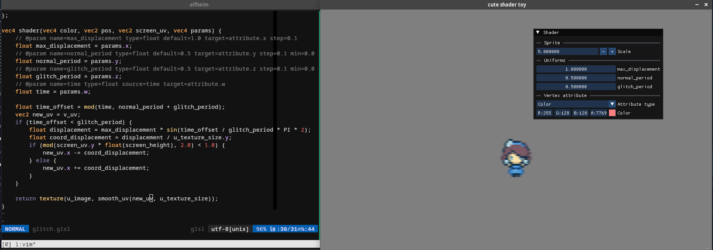

# cute-shader-toy

Shader-toy like tool for [Cute Framework](https://randygaul.github.io/cute_framework/).

# How to use

`bin/RelWithDebInfo/cute-shader-toy default.glsl`.

The shader will be automatically reloaded when it is updated.

Special comments can be used to inform the program about parameters so it can show them in the UI.

The syntax is as follow: `// @param key=value`.
The following keys are recognized.

* `name` (required): Name of the parameter.
* `type` (required): Type of the parameter.
  One of: `float`, `float2`, `float3`, `float4`, `int`, `int2`, `int4`.
  In addition, `color3` and `color4` are aliases for `float3` and `float4` accordingly.
  But a color picker is shown in the UI instead.
  `color` is also an alias for `color4`.
* `source` (optional): How is the parameter set:

  * `ui`: The value is set in the UI.
    This is the default.
  * `time`: Automatically set to [`CF_SECONDS`](https://randygaul.github.io/cute_framework/time/cf_seconds/) every frame.
  * `delta_time`: Automatically set to [`CF_DELTA_TIME`](https://randygaul.github.io/cute_framework/time/cf_delta_time/) every frame.
  * `screen.w`: The screen's width.
  * `screen.h`: The screen's height.
* `default` (optional): Default value for each parameter.

  * `default.x`, `default.r`, `default.s`, `default.u`, `default`: Set the first component.
  * `default.y`, `default.g`, `default.t`, `default.v`: Set the second component.
  * `default.z`, `default.b`, `default.p`: Set the third component.
  * `default.w`, `default.a`, `default.q`: Set the fourth component.
* `target` (optional): The target of a parameter:

  * `uniform`: Set the parameter as an uniform.
     This is the default.
  * `attribute.x`, `attribute.r`, `attribute.s`, `attribute.u`, `attribute`: The first component of the custom [vertex attribute](https://randygaul.github.io/cute_framework/draw/cf_draw_push_vertex_attributes/).
  * `attribute.y`, `attribute.g`, `attribute.t`, `attribute.v`: The second component of the custom vertex attribute.
  * `attribute.z`, `attribute.b`, `attribute.p`: The third component of the custom vertex attribute.
  * `attribute.w`, `attribute.a`, `attribute.q`: The fourth component of the custom vertex attribute.

For an example, refer to [glitch.glsl](./glitch.glsl).
